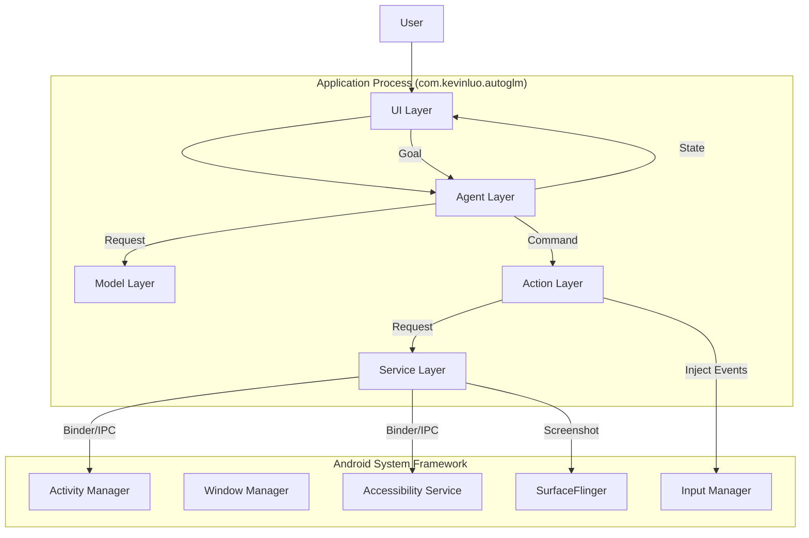
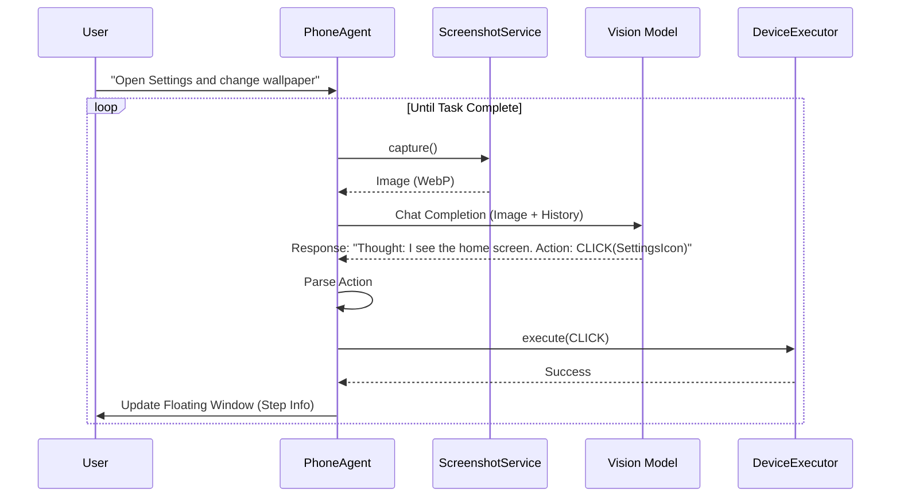

# AutoGLM For Android Technical Documentation

This document provides a detailed technical overview of the AutoGLM For Android Source Code project. It describes the system architecture, core workflows, and key implementation details involved in transforming the application into a integrated System Application.

## 1. Project Overview

**AutoGLM For Android** is a native implementation of an autonomous agent for Android devices. Unlike traditional automation tools that rely on ADB from a PC, this project runs entirely on the device.

By leveraging **System Privileges** (via AOSP build integration), it achieves stable, high-performance interactions without external dependencies like Shizuku or Root (in the traditional sense), making it suitable for OEM integration and custom ROMs.

## 2. System Architecture

The project follows a modular, layered architecture designed for separation of concerns and testability.

### 2.1 High-Level Architecture

### 2.2 Component Layers

1.  **UI Layer**:
    *   **MainActivity**: Configuration, History, and Permission management.
    *   **FloatingWindowService**: An overlay UI that displays the agent's "Thought Process", current step, and allows pausing/stopping tasks. It persists over other apps.

2.  **Agent Layer (**`com.kevinluo.autoglm.agent`**)**:
    *   **PhoneAgent**: The "Brain". Implements the main cognitive loop (Observe -> Think -> Act). It manages the conversation history and task state.
    *   **AgentContext**: Holds the current state of execution.

3.  **Model Layer (**`com.kevinluo.autoglm.model`**)**:
    *   **ModelClient**: Handles HTTP/SSE communication with Large Vision Models (LVM) like ChatGLM, GPT-4o, etc. It serializes the screen image and prompts.

4.  **Action Layer (**`com.kevinluo.autoglm.action`**)**:
    *   **ActionHandler**: High-level action coordinator.
    *   **DeviceExecutor**: Low-level execution engine. It interacts with Android System APIs to perform Taps, Swipes, Text Input, and App Launches.

5.  **Service / System Layer**:
    *   **ScreenshotService**: Manages screen capture using a robust hybrid strategy (Accessibility API + Shell Fallback).
    *   **AutoGLMAccessibilityService**: A standard Android Accessibility Service used for reliable screen capture and potential UI tree retrieval.
    *   **ComponentManager**: A centralized Dependency Injection (DI) container that manages the lifecycle of all singleton components.

---

## 3. Core Working Principle

The core of AutoGLM is the **ReAct (Reasoning + Acting)** loop, adapted for Android GUI interaction.

### 3.1 The Execution Loop

1.  **Observation (Capture)**:
    The Agent requests a screenshot. The `ScreenshotService` attempts to capture the current frame using `AccessibilityService` (preferred) or falls back to `screencap` (Shell). The image is compressed to WebP.

2.  **Reasoning (Think)**:
    The image, along with the user's goal and operation history, is sent to the VLM.
    *   **Prompt Engineering**: A specialized System Prompt instructs the model to act as a mobile phone assistant, outputting thoughts and specific coordinate-based actions.

3.  **Planning (Parse)**:
    The model's text response is parsed by `ActionParser` into structured `AgentAction` objects (e.g., `CLICK(x, y)`, `INPUT(text)`).

4.  **Execution (Act)**:
    The `ActionHandler` dispatches actions to `DeviceExecutor`.
    *   **Click/Swipe**: Injected via `InputManager` (using system privileges) or `Instrumentation`.
    *   **Text**: Injected via `AutoGLMKeyboard` or Direct IME APIs.
    *   **Home/Back**: Injected as Key Events.

5.  **Reflection**:
    The result of the action is recorded. The loop repeats until the model outputs a `FINISH` signal or the user cancels.

### 3.2 Flowchart

---

## 4. System Integration Implementation

This fork distinguishes itself by deep integration into the Android System, removing the need for ad-hoc tools like Shizuku.

### 4.1 System Application Status (`priv-app`)
*   **Build System**: The project uses `Android.bp` (Soong) instead of Gradle for the final system build.
*   **UID**: `android:sharedUserId="android.uid.system"` is defined in `AndroidManifest.xml`. This grants the application the same user ID (1000) as the core system process.
*   **Privileges**: The app runs with platform signature (`certificate: "platform"`), allowing it to hold permissions like `WRITE_SECURE_SETTINGS`, `INJECT_EVENTS`, `CAPTURE_SECURE_VIDEO_OUTPUT`.

### 4.2 Screenshot Strategy (Hybrid)

Screen capture on Android, especially in **Automotive (HSUM)** environments, is complex due to multiple displays and user isolation. We implement a robust strategy:

1.  **Accessibility Service (Primary)**:
    *   The app registers `AutoGLMAccessibilityService`.
    *   On startup, the app utilizes `WRITE_SECURE_SETTINGS` permission to **automatically enable** its own accessibility service, removing user friction.
    *   Uses `takeScreenshot()` API (Android 11+) to capture the screen directly to a Bitmap.

2.  **Shell Fallback (Secondary)**:
    *   If Accessibility fails, it falls back to executing `screencap` via `Runtime.exec`.
    *   **Multi-Display Discovery**: It parses `dumpsys SurfaceFlinger` to identify valid physical Display IDs (crucial for Automotive where the main screen might not be ID 0) and attempts capture on each valid display.
    *   Files are written to `/data/local/tmp` to bypass user-specific storage isolation issues.

### 4.3 Input Injection

Instead of ADB shell commands (`input tap`), which are slow, the system integration allows:
*   **Direct API Implementation**: Using `InputManager` or `Instrumentation` internal APIs via reflection or system SDK to inject `MotionEvent` directly into the input queue.
*   **Zero Latency**: Actions are executed instantly without shell process overhead.

### 4.4 Permission Management

A privileged permission allowlist (`permissions_com.kevinluo.autoglm.xml`) is pushed to `/system/etc/permissions/` to explicitly grant signature permissions to the app, compliant with Android's security model for system apps.

---

## 5. Module Details

| Module | Description |
| :--- | :--- |
| **agent** | Contains `PhoneAgent` state machine. Manages the lifecycle of a task. |
| **model** | Handles API connectivity. Supports OpenAI compatibility and image encoding. |
| **action** | Responsible for parsing model output strings into executable implementation classes. |
| **device** | Abstracts the hardware operations. Handles coordinate transformation and input injection. |
| **service** | Android Service components. `AutoGLMAccessibilityService` acts as the bridge to UI system. |
| **ui** | View layer. Uses MVVM pattern. `MainViewModel` drives the UI state. |

## 6. Security Considerations

*   **Privacy**: Screenshots are processed in memory and sent only to the configured Model API.
*   **Sensitive Data**: `ScreenshotService` respects the `FLAG_SECURE` window flag (if supported by the API) but primarily relies on the model to not act on sensitive info if instructed.
*   **System Integrity**: As a system app, it has great power. The `DeviceExecutor` implies actions are deliberate. The Floating Window always provides an immediate "Stop" button for safety.
